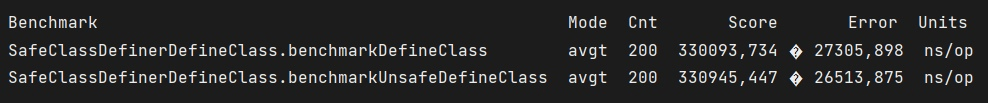

# SafeClassDefiner
Class definer for Java 9+ without using Unsafe.
## Why not Unsafe?
Unsafe is slightly faster, but from the name we can understand that it is insecure and can be removed at any time.
## Why not MethodHandles.Lookup?
The SafeClassDefiner backend uses a MethodHandles.Lookup, but it can define classes in any package available to its lookup and any ClassLoader.
## Benchmark results on my computer

## Example usage
```java
ClassDefiner classDefiner = ClassDefiner.createSafeClassDefiner();
classDefiner.defineClass(myBytes, classLoader);
classDefiner.defineHiddenClass(myBytes, classLoader);
```
## Dependencies
ASM (9.2) for generating empty classes.
## Test dependencies
JUnit (5.8.2)